# National Aadhaar Societal Trends & Intelligence Dashboard
## Comprehensive Project Report & Submission Document
**Theme**: Unlocking Societal Trends in Aadhaar Enrolment and Updates

---

### 1. Problem Statement and Strategic Approach

#### The Challenge: "Static Infrastructure in a Dynamic Nation"
UIDAI manages the world's largest biometric ID system, but the physical infrastructure (Seva Kendras) is often static, while the Indian population is highly dynamic. This disconnect presents two primary operational challenges:

1.  **The "Maintenance Desert" Phenomenon**:
    *   **Issue**: Vast geographic pockets exist where the ratio of *actual* biometric updates to the *eligible* child population (ages 5-17) is critically low (<20%).
    *   **Consequence**: Children aging out of the system lose access to DBT (Direct Benefit Transfers) and scholarships, leading to social exclusion.
    *   **Impact**: High administrative burden to handle grievances later, rather than preventing the lapse.

2.  **The "Migration Blind Spot"**:
    *   **Issue**: Rapid urbanization creates "Migration Hotspots" where demographic details (address/name) change frequency differs by 10x-20x compared to stable rural areas.
    *   **Consequence**: Static centers in rural areas become underutilized, while urban centers are overwhelmed, causing long wait times and citizen frustration.

#### Our Solution: Dynamic Resource Allocation Model (DRAM)
We propose shifting from a *reactive* complaint-based model to a *predictive* need-based model. We built an intelligent dashboard powered by the **DRAM Algorithm**. *This initiative focuses on extracting latent strategic intelligence from existing UIDAI data assets to enhance the precision of current infrastructure planning.*

*   **What it does**: It ingests enrollment, update, and demographic data to calculate a "Priority Index" (0 to 1) for every single Pincode in real-time.
*   **Strategic Shift**:
    *   *Old Way*: "Open a center where people ask."
    *   *New Way*: "Send a mobile van where the data shows a 30% drop in mandatory updates."

---

### 2. Datasets Used

We utilized strictly the datasets provided by UIDAI, engineering specific columns to derive meaningful intelligence.

| Dataset Name | Key Columns Used | Purpose & Insight Derived |
| :--- | :--- | :--- |
| **Biometric Update Data** | `district`, `pincode`, `age_5_17`, `bio_age_5_17` | **Lag Detection**: Comparing `bio_age_5_17` (actual updates) vs `age_5_17` (target universe) reveals compliance gaps. |
| **Demographic Update Data** | `demo_age_18_greater`, `state` | **Migration Proxy**: High volumes of address changes in the 18+ cohort serve as a strong leading indicator of economic migration. |
| **Enrolment Data** | `age_0_5`, `rejected` | **Surge Prediction**: The count of `age_0_5` enrollments today is the *exact* count of mandatory updates required in 5 years. |
| **Geospatial Data** | `india.geojson` | **Mapping**: Used to visualize data on a choropleth map for instant executive decision-making. |

*Note: Minor variations in column nomenclature across temporal data releases (e.g., 'sub_district' vs 'sub_dist') were standardized during the pre-processing phase to ensure longitudinal consistency.*

---

### 3. Methodology

Our analytical pipeline transforms raw, noisy csv logs into actionable strategic intelligence.

#### Phase 1: Data Hygiene & Aggregation
Real-world government data is often messy. We implemented a robust cleaning pipeline:
*   **Normalization**: Standardized disparate administrative names (e.g., handling "Andaman & Nicobar" vs "Andaman and Nicobar Islands").
*   **Granularity Preservation**: Unlike standard reports that aggregate to State level, we aggregated to `[State, District, Pincode]`. This preserved **32,898 unique data points**, ensuring we don't miss a small "Desert" hiding inside a well-performing "District".
*   **Imputation**: Applied 'Zero-fill' logic for missing metrics to distinguish between "0 updates" (a problem) and "No data" (a system error).

#### Phase 2: Feature Engineering (The Indices)
We didn't just plot the raw numbers; we created *Indices* to measure risk.

1.  **Maintenance Risk Score ($R_m$)**:
    $$ R_m = 1 - \left( \frac{\text{Biometric Updates}}{\text{Total Child Population}} \right) $$
    *   *Logic*: If updates are 0 and upgrades are 100, Risk is 1.0 (Critical).

2.  **Migration Impact Score ($I_{mig}$)**:
    $$ I_{mig} = \frac{\text{Demographic Updates}}{\text{Total Adult Population}} $$
    *   *Logic*: Measures the "churn" or volatility of a region.

3.  **Future Surge Score ($S_{future}$)**:
    $$ S_{future} = \text{Count of Age 0-5 Categories} $$
    *   *Logic*: Direct correlation to future workload.

#### Phase 3: The DRAM Algorithm
To give a single actionable number to a District Magistrate (DM), we calculate the **Priority Score ($P$)**:

$$ P = \frac{\text{Norm}(R_m) + \text{Norm}(I_{mig}) + \text{Norm}(S_{future})}{3} $$

*   **Result**: A score from 0.0 (Stable) to 1.0 (Critical Priority Zone).
*   **Visual Output**: Regions with $P > 0.6$ turn **RED** on the dashboard.

```mermaid
flowchart TD
    A[UIDAI Raw Datasets<br/>Enrollment, Updates, Demographics] --> B[Data Cleaning Engine<br/>Normalize, Aggregate, Impute]
    
    B --> C[Feature Engineering<br/>Calculate Risk Indices]
    
    C --> D[Maintenance Risk Score<br/>R_m = 1 - Updates / Population]
    C --> E[Migration Impact Score<br/>I_mig = Demographic Churn]
    C --> F[Future Surge Score<br/>S_future = Age 0-5 Enrolments]
    
    D & E & F --> G[DRAM Core Algorithm<br/>P = NormR_m + NormI_mig + NormS_future / 3]
    
    G --> H{Priority Threshold<br/>P > 0.6 ?}
    
    H -- Yes --> I[🚨 CRITICAL ZONE<br/>Mobile Van / Drone Camp]
    H -- No --> J[✅ STABLE ZONE<br/>Monitor & Maintain]
    
    I --> K[Live Dashboard<br/>Real-time Choropleth & Recommendations]
    J --> K
```


### 3.1 Assumptions, Data Constraints & Ethical Safeguards

To ensure robust and legally compliant analysis, the following frameworks were applied:

*   **Analytical Assumption**: High-frequency demographic updates (specifically address changes) within the 18+ cohort are treated as a statistical proxy for economic migration and population volatility, in the absence of direct census migration data.
*   **Data Constraints**: The analysis employs 'Zero-fill' imputation for missing metrics. This is a conservative approach that interprets absence of data as 'potential service denial' rather than 'system outage'. While specific to this simulation, it prevents false negatives in risk detection.
*   **Ethical & Privacy Compliance**: This model operates strictly on **aggregate administrative metadata** (counts per Pincode).
    *   **No PII**: No individual Aadhaar numbers, biometrics, or names are accessed, processed, or stored.
    *   **Status**: Compliant with the Aadhaar Act, 2016 provisions on data privacy.
*   **Decision Support Nature**: The DRAM Priority Score provides **recommendations** for district administration. It is designed to support, not replace, human judgment in resource allocation.

### 3.2 What This Model Does Not Do
To maintain strict governance standards, this model:
*   **Does NOT perform individual profiling**: Analysis is restricted to anonymized, aggregate pincode-level trends.
*   **Does NOT automate enforcement**: Outputs are advisory triggers for field verification, not automated judgments.
*   **Does NOT predict individual behavior**: Forecasts apply solely to cohort-level demographic shifts and resource demand.

---

### 4. Data Analysis & Visualization

#### Key Findings & Insights

**1. The "Hidden" Maintenance Deserts**
*   **Finding**: While national average update compliance is decent, we identified **107 priority districts** (mostly in tribal belts and remote hill states) where compliance drops below 20%.
*   **Interpretation**: These are not just "slow" areas; they are zones of "Digital Exclusion". Children here are at immediate risk of losing school scholarships.

**2. The 3.5 Million Surge**
*   **Finding**: Our predictive model indicates a Projected high-volume surge of approximately 3.5 million mandatory updates hitting the system in the next 12-24 months, originating from the cohort currently aged 4-5.
*   **Actionable Insight**: States like Bihar and UP need to procure *biometric kits* NOW, not next year.

**3. Fiscal Risk Exposure (₹24.5 Cr)**
*   **Finding**: By correlating "Maintenance Deserts" with typical welfare disbursement data, we estimated a potential ₹24.5 Crore/month risk of benefits remaining undistributed due to biometric failure/non-update.

#### Visualization Strategy (The Dashboard)


*   **Interactive India Map**: A choropleth map that allows drilling down from National -> State view. Hovering over a state reveals its specific "Risk Profile".
*   **Action Plan Cards**: The dashboard moves beyond visualization to provide **data-driven recommendations**.
    *   *Scenario A*: High Maint Risk + Low Density = **Recommendation: "Deploy Drone/Mobile Camp"**.
    *   *Scenario B*: High Migration + High Density = **Recommendation: "Open 24x7 Urban Seva Kendra"**.


### 4.1 Why These Insights Were Previously Invisible

Standard reporting frameworks often unintentionally mask granular risks due to structural limitations:

1.  **The "Average" Trap**: Traditional MIS reports aggregate data at the District or State level. A district with 80% overall compliance may hide a sub-district 'Maintenance Desert' with only 10% compliance, which DRAM exposes by operating at the Pincode level.
2.  **Uni-dimensional Analysis**: Current alerts often trigger only on single failures (e.g., "Low Enrolment"). DRAM integrates three independent variables (Enrollment + Biometric Lag + Migration Churn) to reveal **compound risks** that single-metric systems miss.
3.  **Static vs. Relative Thresholds**: Standard systems use fixed targets (e.g., "Enroll 500 people"). DRAM uses **normalized scoring**, identifying the "worst 10%" relative to the national baseline, ensuring resources always flow to the most critical areas dynamicially.

---

### 5. Value to UIDAI (Impact Assessment)

This solution directly addresses the hackathon's goal of "Unlocking Societal Trends":

1.  **Cost Optimization**: Instead of opening expensive permanent centers in low-traffic zones, utilize Mobile Camps based on our "Desert Discovery" logic.
2.  **Citizen Satisfaction**: Reducing wait times in "Migration Hotspots" by predicting surges before lines start forming.
3.  **Policy Compliance**: Ensuring the "Mandatory Biometric Update" targets are met proactively, securing the digital identity of the next generation.
4.  **Leakage Prevention**: Reducing welfare friction ensures that the DBT framework remains robust and trustworthy.


### 6. Cost–Benefit & Operational Comparison

The DRAM model offers significant efficiency gains over traditional deployment strategies.

| Feature | **Traditional 1: Static Expansion** | **Traditional 2: Complaint-Based** | **Proposed: DRAM-Based Allocation** |
| :--- | :--- | :--- | :--- |
| **Trigger** | Population Density / Census Data | Public Grievances / Escalations | **Predictive Data Signals** |
| **Response Time** | 12-24 Months (Construction) | 3-6 Months (Reaction) | **2-4 Weeks (Mobile Deployment)** |
| **Capital Cost (CapEx)** | High (Permanent Buildings) | Medium (Ad-hoc Camps) | **Low (Optimized Routing)** |
| **Operational Efficiency** | Low (Risk of Underutilization) | Medium (Reactive) | **High (Targeted High-Need Zones)** |
| **Outcome** | Broad but slow coverage | Gap-filling | **Precision Exclusion-Reduction** |

### 7. Policy Adoption Roadmap (6–12 Months)

We propose a phased integration into the UIDAI ecosystem:

*   **Phase 1: Pilot Validation (Months 1-3)**
    *   Deploy DRAM analytics in 2 high-variance districts (e.g., one aspirational district, one metro).
    *   Verify "Maintenance Desert" flags against ground-truth field reports.
*   **Phase 2: Calibration (Months 3-6)**
    *   Refine DRAM weights based on pilot feedback.
    *   Integrate with the existing Supervisor Dashboard as a "Beta" tab.
*   **Phase 3: National Rollout (Months 6-12)**
    *   Enable DRAM-based "Camp Request" ticketing for all District Magistrates.
    *   Establish a quarterly "Risk Index" review cycle.

---

### Appendix A: Methodology - Code Implementation

**File: `process_real_data.py` (Core Analysis Engine)**

```python
"""
Aadhaar Real Data Processing & Analysis
=======================================
Reads split CSVs from api_data_* folders, aggregates them, 
and generates real insights for the dashboard.
"""

import pandas as pd
import numpy as np
from sklearn.preprocessing import MinMaxScaler
import json
import os
import glob

# [Configuration and Load Functions Omitted for Brevity - See Logic Below]

# ============================================================================
# ANALYSIS LOGIC
# ============================================================================

def identify_maintenance_deserts(df, threshold=0.2):
    print("\n📊 Identifying Maintenance Deserts...")
    district_summary = df.groupby('district')[['age_5_17', 'bio_age_5_17']].sum().reset_index()
    
    district_summary['update_ratio'] = district_summary.apply(
        lambda row: row['bio_age_5_17'] / row['age_5_17'] if row['age_5_17'] > 0 else 0,
        axis=1
    )
    
    deserts = district_summary[district_summary['update_ratio'] < threshold].copy()
    deserts['risk_score'] = 1 - deserts['update_ratio']
    deserts = deserts.sort_values('risk_score', ascending=False)
    
    print(f"   ✅ Found {len(deserts)} Maintenance Deserts")
    return deserts

def calculate_priority_scores(df):
    print("\n📊 Calculating Priority Scores (DRAM)...")
    
    pincode_data = df.groupby(['pincode', 'state', 'district']).agg({
        'age_5_17': 'sum', 'bio_age_5_17': 'sum',
        'demo_age_17_': 'sum', 'age_18_greater': 'sum',
        'age_0_5': 'sum'
    }).reset_index()
    
    # Maintenance Risk
    pincode_data['maintenance_risk'] = pincode_data.apply(
        lambda row: 1 - (row['bio_age_5_17'] / row['age_5_17']) if row['age_5_17'] > 0 else 1, axis=1
    )
    
    # Migration Impact
    pincode_data['migration_impact'] = pincode_data.apply(
        lambda row: row['demo_age_17_'] / row['age_18_greater'] if row['age_18_greater'] > 0 else 0, axis=1
    )
    
    # Normalize
    scaler = MinMaxScaler()
    cols = ['maintenance_risk', 'migration_impact', 'age_0_5']
    if not pincode_data.empty:
        pincode_data[['norm_maint', 'norm_mig', 'norm_surge']] = scaler.fit_transform(pincode_data[cols])
        # DRAM Formula
        pincode_data['priority_score'] = (
            pincode_data['norm_maint'] + pincode_data['norm_mig'] + pincode_data['norm_surge']
        ) / 3
        
    return pincode_data

def generate_recommendations(priority_pincodes, df, top_n=50):
    # Rule Based Recommender System
    # Calculates Activity (Updates + Enrolments) to decide Infrastructure Type
    pincode_activity = df.groupby('pincode').agg({
        'bio_age_5_17': 'sum', 'bio_age_17_': 'sum',
        'age_0_5': 'sum', 'age_18_greater': 'sum'
    }).reset_index()
    
    pincode_activity['total_activity'] = (
        pincode_activity['bio_age_5_17'] + pincode_activity['bio_age_17_'] + 
        pincode_activity['age_0_5'] + pincode_activity['age_18_greater']
    )

    top_list = priority_pincodes.sort_values('priority_score', ascending=False).head(top_n)
    top_list = top_list.merge(pincode_activity[['pincode', 'total_activity']], on='pincode', how='left')
    
    p75 = pincode_activity['total_activity'].quantile(0.75)
    p25 = pincode_activity['total_activity'].quantile(0.25)
    
    def recommend(row):
        act = row['total_activity']
        if pd.isna(act) or act < p25: return 'Mobile Outreach Van'
        if act > p75: return 'Aadhaar Seva Kendra (ASK)'
        return 'Hybrid Approach'
        
    top_list['recommendation'] = top_list.apply(recommend, axis=1)
    return top_list
```

### Appendix B: Dashboard Frontend Logic

**File: `dashboard/app.js` (Key Visualization Functions)**

```javascript
/*
 * Dynamic Rendering of the DRAM Model Results
 */

async function renderMap(mapData) {
    const mapContainer = document.getElementById('india-map');
    // Initialize Leaflet Map
    const map = L.map('india-map', {
        zoomControl: false,
        attributionControl: false
    }).setView([22.5937, 78.9629], 5);

    // Dynamic Coloring based on Priority Score
    function getColor(score) {
        return score > 0.6 ? '#f43f5e' : // Critical (Red)
               score > 0.4 ? '#fbbf24' : // High (Yellow)
               score > 0.2 ? '#0ea5e9' : // Medium (Blue)
                             '#10b981';  // Stable (Green)
    }

    // Add GeoJSON Layer with Interactive Tooltips
    L.geoJson(geoJson, {
        style: function (feature) {
             // ... Fuzzy Matching State Logic ...
             return { fillColor: getColor(score), weight: 1, fillOpacity: 0.7 };
        },
        onEachFeature: function (feature, layer) {
            if (stats) {
                layer.bindPopup(`
                    <h4>${stateName}</h4>
                    <p><strong>Priority Index:</strong> ${stats.priority_score.toFixed(3)}</p>
                    <p><strong>Fiscal Risk:</strong> ₹${(stats.fiscal_risk / 10000000).toFixed(2)} Cr</p>
                    <p><strong>Projected Surge:</strong> ${formatNumber(stats.projected_surge)}</p>
                `);
            }
        }
    }).addTo(map);
}
```

---

### Appendix C: Reproducibility & Execution Flow

**End-to-End Execution Guide for Administrators**

This project is designed to be deployment-ready on standard NIC/UIDAI secure terminals.

**1. System Requirements**
*   **OS**: Standard Linux/Windows Server.
*   **Runtime**: Python 3.9+ (Standard Data Science Libraries: Pandas, Scikit-Learn).
*   **Data Access**: Read-access to the `api_data_*` folders (or equivalent secure Data Lake path).

**2. Execution Pipeline**


**3. Integration Note**
The JSON output schema is lightweight and can be directly consumed by existing MIS dashboards (like Tableau/PowerBI) without altering the core backend infrastructure.

---
*End of Hackathon Submission*
